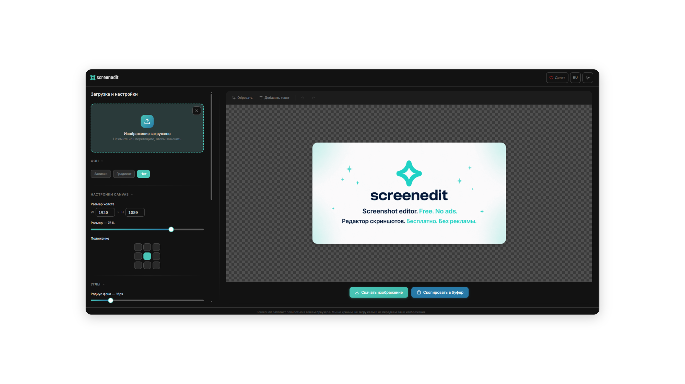

# ScreenEdit

**Edit and style screenshots and images — right in your browser.**

Upload, crop, add backgrounds, shadows, rounded corners and text overlays, then export as PNG, JPEG or WebP — or copy straight to your clipboard. No sign-up, no upload to a server: everything runs client-side.

🔗 **[Try it live → screenedit.online](https://screenedit.online)**

[](LICENSE)
[](https://screenedit.online)



---

## Why ScreenEdit

- 🎨 Style any screenshot with gradients, shadows, rounded corners and custom backgrounds
- ✍️ Add draggable, resizable, rotatable text overlays with 21 fonts and full styling control
- ⚡ Instant export to PNG / JPEG / WebP, or copy to clipboard — no waiting, no uploads
- ↩️ Full undo/redo history across every action
- 🌗 Dark theme by default, EN/RU interface auto-detected from your browser
- 🔒 100% client-side — your images never leave your machine

---

## Features

### Image styling
- Drag & drop, click to upload, or paste with `Ctrl+V` (up to 50 MB)
- Crop with a rule-of-thirds overlay
- Background: solid color, two-color gradient with adjustable angle, or transparent
- Custom canvas size, border radius (background + image), and shadow controls (offset, blur, spread, opacity, color)
- 9 image position presets on a 3×3 grid, plus a size slider (10–100%)

### Text overlays
- Draggable, resizable, rotatable text with on-canvas handles
- 21 fonts, including Inter, Roboto, Montserrat, Playfair Display, Fira Code and Bebas Neue, plus system fonts
- Adjustable weight (100–900), italic, size (8–400px) and color
- Rotation with dedicated handle and **45° snap** (toggle or hold `Shift`)
- 8 resize handles for proportional scaling
- Text shadow with offset, blur, opacity and color controls
- Axis-locked movement (hold `Shift` while dragging)

### Export & UX
- Export to PNG, JPEG or WebP
- Copy directly to clipboard (desktop)
- Undo / redo (`Ctrl+Z` / `Ctrl+Shift+Z`) across crop, delete and settings changes
- EN / RU interface, auto-detected from the browser
- Dark theme by default, with a light mode toggle
- `/privacy` page covering GDPR, Google Fonts and Vercel

---

## Tech stack

| Category | Tools |
|----------|-------|
| Framework | React 18 + TypeScript |
| Build | Vite 6 |
| Styling | Tailwind CSS 4 + `motion` (animations) |
| Icons | Lucide React |
| Rendering | Canvas API |
| Crop | react-image-crop v11 |
| Color picker | @uiw/react-color-sketch |
| Routing | react-router v7 |
| Fonts | 13 Google Fonts (Inter, Roboto, Montserrat…) |

---

## Getting started

**Requirements:** Node.js 18+

```bash
git clone https://github.com/karkovv/screenedit.git
cd screenedit
npm install
npm run dev
```

Build for production:

```bash
npm run build
```

---

## Contributing

Issues and pull requests are welcome. If you're planning a larger change, please open an issue first to discuss what you'd like to change.

---

## License

[MIT](LICENSE)
